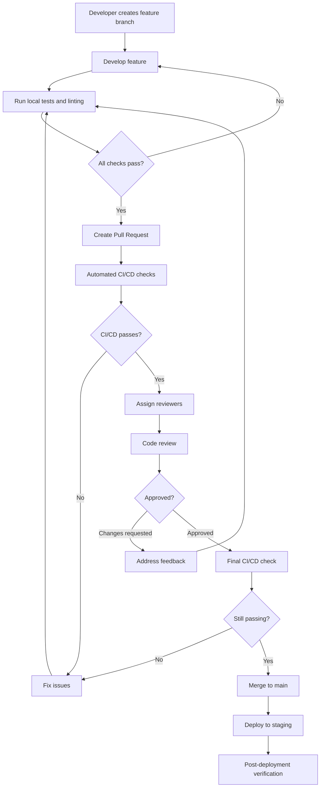

# Code Review Process Workflow

## Overview

This document outlines the complete code review process for the Dreamer AI Solutions project, from initial development through final merge.

## Process Flow



## Detailed Steps

### 1. Pre-Development Setup

Before starting development:

1. **Pull latest main branch**
   ```bash
   git checkout main
   git pull origin main
   ```

2. **Create feature branch**
   ```bash
   git checkout -b feature/JIRA-123-feature-name
   ```

3. **Set up pre-commit hooks**
   ```bash
   npm run setup:hooks
   ```

### 2. Development Phase

During development:

1. **Follow coding standards** (see CODE_REVIEW_GUIDELINES.md)
2. **Write tests** as you code (TDD preferred)
3. **Document** complex logic
4. **Commit frequently** with meaningful messages

#### Commit Message Format
```
<type>(<scope>): <subject>

<body>

<footer>
```

Example:
```
feat(auth): add OAuth2 integration

- Implement Google OAuth2 provider
- Add refresh token rotation
- Update user model with OAuth fields

Closes #123
```

### 3. Pre-Submission Checklist

Before creating a PR, ensure:

- [ ] All tests pass locally
  ```bash
  npm test
  ```
- [ ] Code is properly formatted
  ```bash
  npm run format
  ```
- [ ] No linting errors
  ```bash
  npm run lint
  ```
- [ ] Coverage meets requirements
  ```bash
  npm run test:coverage
  ```
- [ ] No security vulnerabilities
  ```bash
  npm run security:check
  ```
- [ ] Documentation is updated
- [ ] Commit messages follow convention

### 4. Creating a Pull Request

1. **Push branch to remote**
   ```bash
   git push -u origin feature/JIRA-123-feature-name
   ```

2. **Create PR via GitHub UI or CLI**
   ```bash
   gh pr create --title "feat(auth): add OAuth2 integration" \
                --body "$(cat PR_TEMPLATE.md)"
   ```

3. **Fill out PR template completely**
   - Description
   - Type of change
   - Testing performed
   - Screenshots (if UI changes)
   - Related issues

### 5. Automated Checks

The CI/CD pipeline automatically runs:

1. **Code Quality Checks**
   - ESLint
   - Prettier
   - TypeScript compilation

2. **Testing**
   - Unit tests
   - Integration tests
   - Coverage analysis

3. **Security Scanning**
   - npm audit
   - Snyk vulnerability scan
   - SAST analysis

4. **Performance Analysis**
   - Bundle size check
   - Lighthouse audit (frontend)
   - Load testing (backend)

5. **Documentation**
   - API documentation generation
   - README validation

### 6. Review Assignment

#### Automatic Assignment
- Code owners are automatically assigned based on CODEOWNERS file
- Round-robin assignment for general reviews

#### Manual Assignment
- Author can request specific reviewers
- Tech lead assigns for critical changes

#### Review Requirements
- Minimum 1 approval for regular changes
- 2 approvals for:
  - Security-related changes
  - Architecture changes
  - Public API changes
  - Database schema changes

### 7. Review Process

#### For Reviewers

1. **Initial Assessment** (5 minutes)
   - Read PR description
   - Check CI/CD status
   - Review changed files overview

2. **Detailed Review** (time varies)
   - Use CODE_REVIEW_CHECKLIST.md
   - Check functionality
   - Verify tests
   - Assess security implications
   - Review performance impact

3. **Provide Feedback**
   - Be constructive and specific
   - Suggest improvements
   - Acknowledge good practices
   - Use review comments effectively:
     - 🚨 **MUST FIX**: Critical issues
     - ⚠️ **SHOULD FIX**: Important but not blocking
     - 💡 **CONSIDER**: Suggestions for improvement
     - ❓ **QUESTION**: Clarification needed
     - ✅ **PRAISE**: Good code deserves recognition

4. **Review Verdict**
   - ✅ **Approve**: Ready to merge
   - 💬 **Comment**: Feedback without blocking
   - ❌ **Request Changes**: Must address before merge

#### For Authors

1. **Respond to all feedback**
   - Address each comment
   - Explain decisions
   - Ask for clarification if needed

2. **Make requested changes**
   - Commit with clear messages
   - Update PR description if scope changes

3. **Re-request review**
   - Click "Re-request review" button
   - Notify reviewers of updates

### 8. Approval and Merge

#### Merge Criteria
- All CI/CD checks passing
- Required approvals received
- No unresolved comments
- Up-to-date with main branch
- No merge conflicts

#### Merge Strategy
- **Squash and merge** for feature branches
- **Merge commit** for release branches
- **Rebase and merge** for hotfixes

#### Post-Merge
1. Delete feature branch
2. Update JIRA ticket
3. Monitor deployment
4. Verify in staging environment

### 9. Special Scenarios

#### Hotfixes
1. Create branch from main: `hotfix/JIRA-XXX-description`
2. Minimal changes only
3. Expedited review process
4. Direct deployment after approval

#### Breaking Changes
1. Require 2+ approvals
2. Update migration guide
3. Version API appropriately
4. Notify stakeholders

#### Large PRs
1. Consider splitting into smaller PRs
2. Provide review guide in description
3. Schedule synchronous review if needed

### 10. Review Metrics and SLAs

#### Response Times
| Priority | Initial Review | Follow-up Review |
|----------|---------------|------------------|
| Critical | 2 hours | 1 hour |
| High | 4 hours | 2 hours |
| Normal | 24 hours | 12 hours |
| Low | 48 hours | 24 hours |

#### Quality Metrics
- Average review turnaround time
- Defect escape rate
- Review effectiveness score
- Code coverage trend

### 11. Best Practices

#### For Authors
1. **Keep PRs small** (<400 lines)
2. **One feature per PR**
3. **Self-review first**
4. **Provide context**
5. **Be responsive**

#### For Reviewers
1. **Review promptly**
2. **Be thorough but reasonable**
3. **Focus on correctness first**
4. **Suggest, don't dictate**
5. **Learn from the code**

### 12. Tools and Resources

#### Browser Extensions
- GitHub PR Review Tools
- Octotree for code navigation
- Refined GitHub

#### Review Tools
- GitHub UI
- VS Code GitHub Pull Requests
- IntelliJ GitHub integration

#### Documentation
- CODE_REVIEW_GUIDELINES.md
- CODE_REVIEW_CHECKLIST.md
- CODING_STANDARDS.md

### 13. Escalation Process

If disagreements arise:

1. **Technical Discussion**
   - Discuss in PR comments
   - Provide data/examples
   - Consider alternatives

2. **Team Discussion**
   - Bring to team meeting
   - Get additional opinions
   - Document decision

3. **Tech Lead Decision**
   - Escalate if no consensus
   - Tech lead makes final call
   - Document rationale

### 14. Continuous Improvement

#### Monthly Review
- Analyze review metrics
- Identify bottlenecks
- Update process as needed

#### Quarterly Training
- Code review best practices
- New tools and techniques
- Security awareness

#### Feedback Loop
- Regular retrospectives
- Anonymous feedback channel
- Process improvement suggestions

---

## Quick Reference Card

### PR Checklist for Authors
```bash
# Before creating PR
npm run validate  # Runs lint, format, and tests

# After creating PR
- [ ] Fill out PR template
- [ ] Link related issues
- [ ] Request reviewers
- [ ] Monitor CI/CD status
```

### Review Checklist for Reviewers
```bash
# Quick checks
- [ ] PR description clear?
- [ ] Tests included?
- [ ] CI/CD passing?
- [ ] No security issues?
- [ ] Performance acceptable?
```

### Common Review Comments
```markdown
# Suggestions
Consider using optional chaining here: `user?.profile?.name`

# Questions
Could you explain why this approach was chosen over [alternative]?

# Praise
Great job on the error handling here! Very thorough.

# Must Fix
This could lead to SQL injection. Please use parameterized queries.
```

Remember: The goal is to ship quality code efficiently while fostering a culture of learning and collaboration.